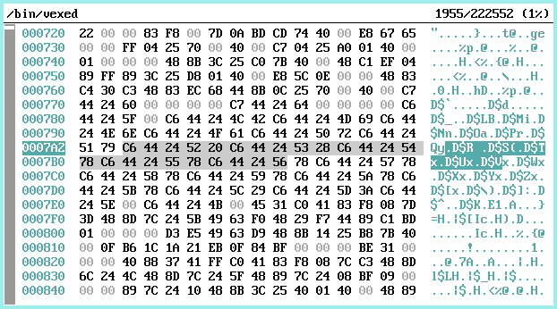

# vexed
A visual hex editor for plan9.



Move using the arrow keys or select using the mouse.  
Scroll with page up/down, the mouse wheel or using the scrollbar.  
Home and End keys go to the beginning and end of the file respectively.  
`g` go to given location which can be entered in decimal or in hexadecimal (starting with 0x).  
`i` inserts a byte before the current selection.  
`p` inserts a byte after the current selection.  
`x` deletes the currently selected byte.  
`u` undo last edit.  
`r` redo last undo'ed edit.  
`l` look for a byte sequence within the file.  
`n' go to next matching occurence of looked sequence.  
Del or q exit the program.  

Feel free to drop me an email would you have any feature request.

## Usage 
```sh
% mk install
% vexed <file>
```

## License
MIT

## Bugs
Nope, only features!

